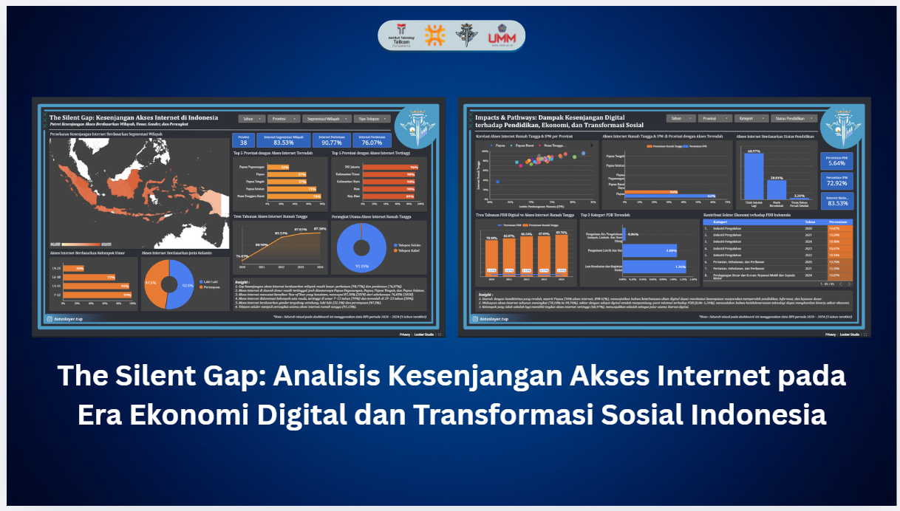
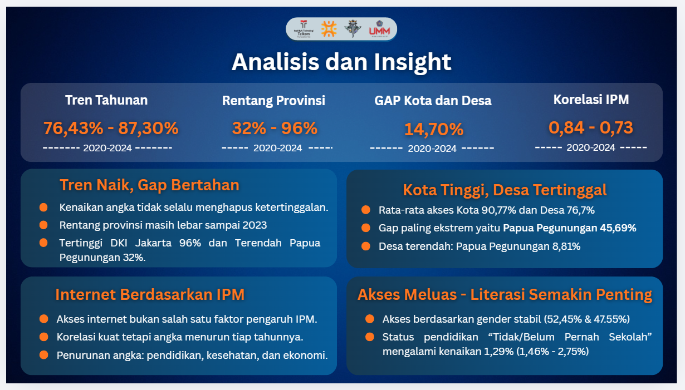
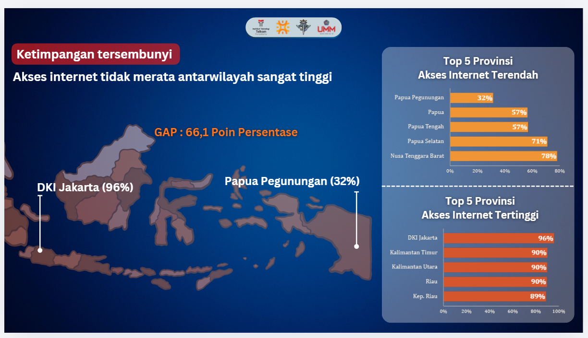
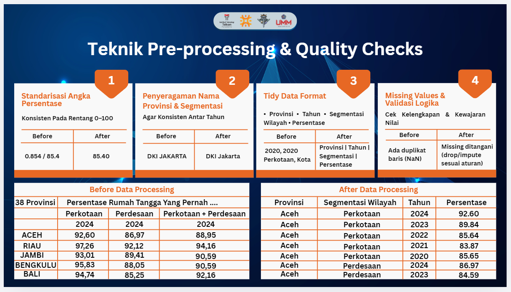
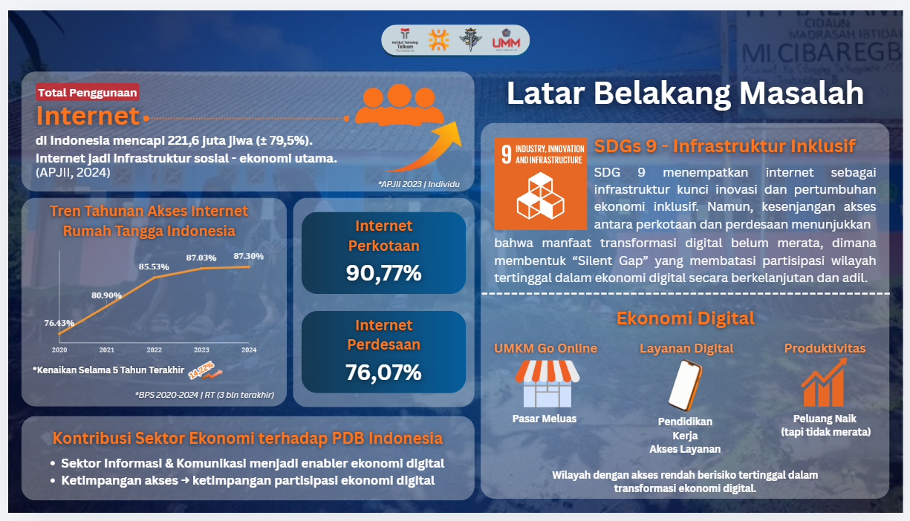

# 🌐 Digital Inequality Analysis in Indonesia  
### Internet Access, Socioeconomic Gap, and Data-Driven Insight

### 🟡 Competition Project (Data Challenge / Hackathon) 2025

---

## 🧠 Project Overview

This project investigates **digital inequality in Indonesia**, focusing on disparities in internet access across provinces, urban–rural segmentation, and its relationship with socioeconomic indicators such as the Human Development Index (HDI).

The analysis adopts a **data-driven analytical approach**, combining preprocessing, exploratory analysis, and interactive dashboard visualization to uncover structural gaps in digital infrastructure.

---

## 🏆 Achievement

**🥉 3rd Place Winner & Finalist — DATA Slayer National Data Analytics Competition 2025**

Hosted by:
- Telkom University Purwokerto  
- HMSD (Himpunan Mahasiswa Sains Data)  
- Pojok Statistik  

This project achieved national recognition for delivering:
- Insight-driven analysis on digital inequality  
- Strong data preprocessing and validation pipeline  
- Effective dashboard storytelling for decision support  

---

## 📊 Interactive Dashboard

👉 https://datastudio.google.com/reporting/353e52a2-1ac4-4dc7-bf86-103de4fb9cbc/page/p_ss2000fgyd  

---

## 📊 Dashboard Overview

The dashboard provides an integrated view of:
- Regional internet access distribution  
- Temporal trends (2020–2024)  
- Socioeconomic correlations  
- Urban vs rural segmentation  

---

## 📑 Presentation Slides

👉 https://canva.link/qua6tq488nlvia4

This presentation provides a structured explanation of:
- Problem background and context  
- Data preprocessing and methodology  
- Analytical findings and insights  
- Strategic recommendations  

It complements the dashboard by delivering a **clear narrative and data storytelling perspective**.

---
## 📌 Key Insights

- Internet penetration increased from **76.43% to 87.30% (2020–2024)**  
- Provincial disparity remains wide (**32% – 96%**)  
- Urban–rural gap persists (~14.7%)  
- Correlation with HDI shows a **declining trend**, indicating diminishing marginal impact  

---

## ⚠️ Critical Finding: Digital Inequality

- **DKI Jakarta:** 96%  
- **Papua Pegunungan:** 32%  
- Gap: **66.1 percentage points**

This indicates that **digital access growth does not automatically ensure equitable distribution**, reinforcing the concept of a *“silent gap”* in development.

---

## 🧪 Data Preparation & Quality Assurance

- Standardization of percentage values  
- Province name normalization  
- Data restructuring into tidy format  
- Missing value handling and validation  

Ensures:
- Data consistency  
- Analytical reliability  
- Robust downstream analysis  

---

## 🌍 Problem Context

- Internet as a key infrastructure in **SDGs 9 (Industry, Innovation, Infrastructure)**  
- Unequal access impacts:
  - Education  
  - Economic participation  
  - Digital transformation  

---

## 📈 Key Findings

- Internet access is increasing but **not evenly distributed**  
- Structural inequality persists across regions  
- Rural areas remain significantly underserved  
- Digital gap reflects broader socioeconomic disparity  

---

## 💡 Practical Implications

- Government policy evaluation  
- Infrastructure investment prioritization  
- Regional development strategy  
- Data-driven public decision making  

---

## 🧩 Tools & Technologies

- Python (Pandas)  
- Excel / CSV Processing  
- Looker Studio (Dashboard Visualization)  
- Exploratory Data Analysis (EDA)  

---

## 👨‍💻 Team & Roles

| Name | Role | Responsibility |
|------|------|---------------|
| **Al Fitra Nur Ramadhani** | Data Engineer | Data collection, preprocessing, data cleaning, and ensuring data quality & consistency |
| **Muhammad Wildan Nabila** | Data Analyst / Data Scientist | Exploratory data analysis (EDA), insight extraction, modeling logic, and analytical interpretation |
| **Irawana Juwita** | Data Analyst | Data visualization, dashboard development (Looker Studio), and storytelling for decision support |

---

## 🚀 Closing

> Transforming data into evidence-based insights to uncover hidden inequality and support inclusive digital transformation.
